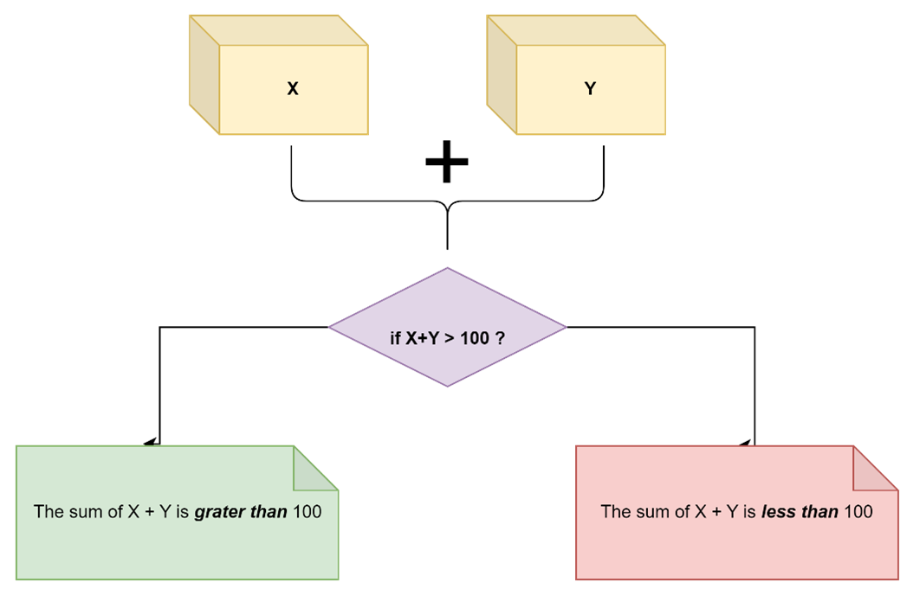

# **Bash Scripts**
### Clone Bash Scripts Repository
* Open terminal
* Clone repository by running the line code below
```bash
https://github.com/RashedKewan/DevOps-Bootcamp-Fusra.git
```
### Running Bash Scripts  

* Move to the repository
```bash
git checkout Bash_Scripts
```
* Move to scripts directory
```bash
cd scripts
```
* Give user permission to execute
```bash
chmod +x *.sh
```

* Run 
```bash
./SCRIPT_NAME.sh
```
##
## In this repository we have three bash scripts that each one do specific task.


>  ### Bash script that collects two numbers from the user and then  prints  a message if these two numbers are smaller or greater than 100.
> 
> ```bash
> # run the script
> $ ./sum_two_numbers.sh
> ```
> Then it going to ask you to enter two numbers ,for example I'v entered 33 , 22
> ```bash
> Please enter two numbers.
> First  number: 33
> Second number: 22
> ```
> `Output`
> ```
> 33 + 22 = 55
> 55 less than 100!
> ```
##


##
> ### Bash script that reads a temperature in Fahrenheit and converts it to Celcius
> 
> ```bash
> # run the script
> $ ./f_to_c.sh
> ```
> Then it going to ask you to enter the temperature in **Fahrenheit** ,for example I'v entered 32
> ```
> Convert Fahrenheit temperature into Celsius temperature
> Enter temperature (F): 32
> ```
> `Output`
> ```
> 32 F = 0 C
> ```
##


##
> ### Bash script that finds the largest 10 files in a directory.
> ```bash
> # run the script
> $ ./top_ten_largests_files.sh
> ```
> Then it going to ask you to enter directory path
> ```
> Please enter directory path: HEAR_YOU_NEED_TO_ENTER_THE_DIRECTORY_PATH
> ```
> `Example`
> ```
> Please enter directory path: /c/Users/diaba/testapp
> ```
> `Output`
> ```
> List of the largest 10 files in /c/Users/diaba/testapp
> --------------------------------------------------------
> 138K    /c/Users/diaba/testapp
> 112K    /c/Users/diaba/testapp/.git
> 49K     /c/Users/diaba/testapp/.git/hooks
> 38K     /c/Users/diaba/testapp/.git/objects
> 20K     /c/Users/diaba/testapp/.git/objects/52
> 11K     /c/Users/diaba/testapp/.git/logs
> 7.0K    /c/Users/diaba/testapp/.git/logs/refs
> 5.0K    /c/Users/diaba/testapp/.git/logs/refs/heads
> 4.0K    /c/Users/diaba/testapp/.git/refs
> 2.0K    /c/Users/diaba/testapp/.git/refs/remotes/origin
> ```
#
