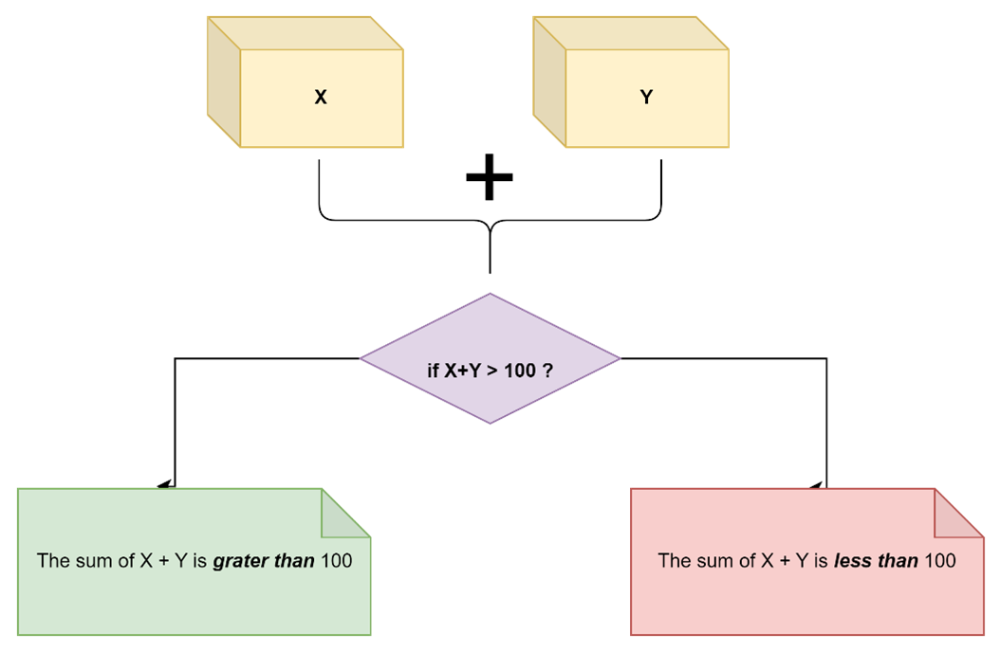

# **Bash Scripts**
### Clone Bash Scripts Repository
* Open terminal
* Clone repository by running the line code below
```bash
git clone https://github.com/RashedKewan/Fursa.git
```
* move to the repository
```bash
git branch -b Bash_Scripts
```
### Running Bash Scripts 
* Give user permission to execute
```bash
chmod +x *.sh
```

* Run 
```bash
./SCRIPT_NAME.sh
```
##
## In this repository we have three bash scripts that each one do specific task.


>  #### *`sum_two_numbers.sh`* it's a bash script that collects two numbers from the user and then  prints  a message if these two numbers are smaller or greater than 100.
> 
##
##
> #### *`f_to_c.sh`* bash script that reads a temperature in Fahrenheit and converts it to Celcius
> 
##
##
> #### *`top_ten_largests_files.sh`* bash script that finds the largest 10 files in a directory.
> ```bash
> # run the script
> $ ./top_ten_largests_files.sh
> Please enter directory path: HEAR_YOU_NEED_TO_ENTER_THE_DIRECTORY_PATH
> ```
> `Example`
> ```bash
> # run the script
> $ ./top_ten_largests_files.sh
> Please enter directory path: /c/Users/diaba/testapp
> ```
> `output`
> ```
> List of the largest 10 files in /c/Users/diaba/testapp
> --------------------------------------------------------
> 138K    /c/Users/diaba/testapp
> 112K    /c/Users/diaba/testapp/.git
> 49K     /c/Users/diaba/testapp/.git/hooks
> 38K     /c/Users/diaba/testapp/.git/objects
> 20K     /c/Users/diaba/testapp/.git/objects/52
> 11K     /c/Users/diaba/testapp/.git/logs
> 7.0K    /c/Users/diaba/testapp/.git/logs/refs
> 5.0K    /c/Users/diaba/testapp/.git/logs/refs/heads
> 4.0K    /c/Users/diaba/testapp/.git/refs
> 2.0K    /c/Users/diaba/testapp/.git/refs/remotes/origin
> ```
#
